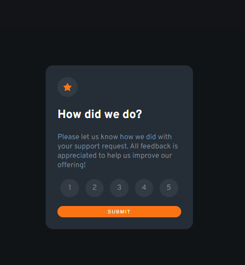

# Frontend Mentor - Interactive rating component solution

This is a solution to the [Interactive rating component challenge on Frontend Mentor](https://www.frontendmentor.io/challenges/interactive-rating-component-koxpeBUmI). Frontend Mentor challenges help you improve your coding skills by building realistic projects. 

## Table of contents

- [Overview](#overview)
  - [The challenge](#the-challenge)
  - [Screenshot](#screenshot)
  - [Links](#links)
- [My process](#my-process)
  - [Built with](#built-with)
  - [What I learned](#what-i-learned)
  - [Continued development](#continued-development)
  - [Useful resources](#useful-resources)
- [Author](#author)
- [Acknowledgments](#acknowledgments)

**Note: Delete this note and update the table of contents based on what sections you keep.**

## Overview

### The challenge

Users should be able to:

- View the optimal layout for the app depending on their device's screen size
- See hover states for all interactive elements on the page
- Select and submit a number rating
- See the "Thank you" card state after submitting a rating

### Screenshot



### Links

- Live Site URL: [See the demo on Github Pages](https://jimi-s-frontend-mentor-cs.github.io/Interactive-Rating-Component/)

## My process

### Built with

- Semantic HTML5 markup
- CSS custom properties
- Flexbox
- Mobile-first workflow

### What I learned

I've learned how to better use flexbox and how to better manage screen sizes for supporting different devices.

I've also learned how to combine two colors using css properties like ```background-blend-mode```.

```css
background-color: var(--clr-dark-blue);
background-image: linear-gradient(var(--clr-very-dark-blue) 0 0);
background-blend-mode: exclusion;
```

I've also learned a new way to style list items and images, with the circular background using the ```line-height``` trick.

```css
.rating-list li {
    width: 2.5em;
    height: 2.5em;
    line-height: 2.5em;
    text-align: center;
    border-radius: 50%;
}
```

### Continued development

I want to continue focusing on flexbox and in general all the standard and better ways to make responsive websites from scratch, without using frameworks like bootstrap.

### Useful resources

- [Circular background styling](https://stackoverflow.com/a/16615584) - This helped me a lot with the list items and image circular styling.
- [Kevin Powell](https://www.youtube.com/kepowob) - This amazing guy helped me A TON getting me back into Web Development, refreshing by knowledge and also teaching me new stuffs and tricks (especially with CSS and flexbox).

## Author

- Frontend Mentor - [@JimiIT92](https://www.frontendmentor.io/profile/JimiIT92)

## Acknowledgments

Big shoutout to [Jawad](https://stackoverflow.com/a/16615584) and [Kevin Powell](https://www.youtube.com/kepowob) for sharing their solutions and resources to the public, so other developers like me can learn new stuff!
